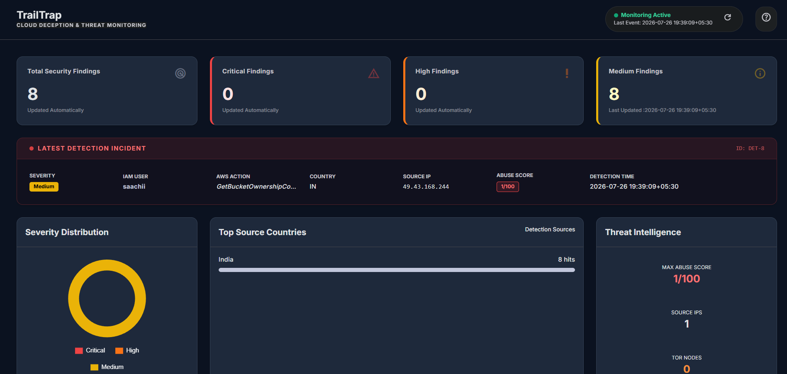
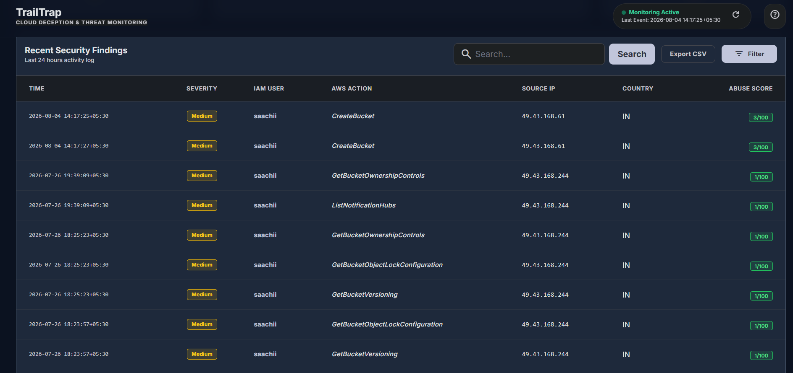
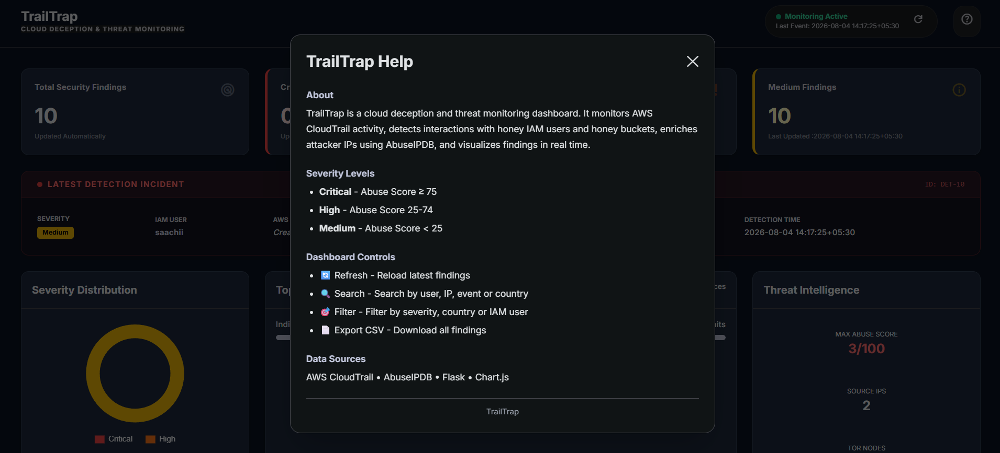
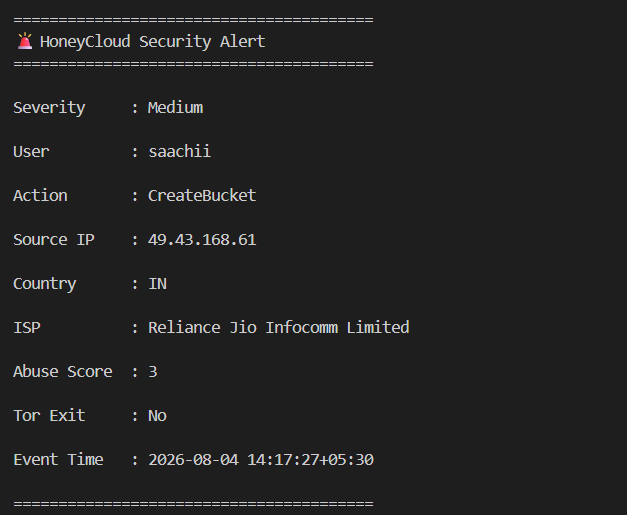

#  TrailTrap

> **Cloud Deception & Threat Monitoring Platform for AWS**

TrailTrap is a cloud deception platform that deploys honey IAM users, honey S3 buckets, and decoy files in an AWS environment to detect unauthorized access attempts. It continuously monitors AWS CloudTrail events, enriches attacker IP addresses using AbuseIPDB threat intelligence, assigns severity levels, and visualizes security findings through an interactive Flask dashboard.

The project demonstrates practical cloud security concepts including deception technology, threat intelligence integration, cloud monitoring, and security analytics.

---

##  Features

###  Cloud Deception

- Deploys Honey IAM Users
- Creates Honey S3 Buckets
- Uploads realistic decoy files
- Detects interactions with deceptive cloud assets

###  Threat Detection

- Monitors AWS CloudTrail events
- Detects access to honey assets
- Prevents duplicate alerts
- Ignores self-generated monitoring events

###  Threat Intelligence

- Integrates with AbuseIPDB API
- Retrieves attacker reputation
- Detects Tor exit nodes
- Identifies attacker country and ISP

###  Severity Classification

TrailTrap classifies incidents based on AbuseIPDB Abuse Confidence Score.

| Severity | Abuse Score |
|----------|------------:|
| 🔴 Critical | ≥ 75 |
| 🟠 High | 25 – 74 |
| 🟡 Medium | < 25 |

###  Interactive Dashboard

- Live security statistics
- Latest detection summary
- Severity distribution chart
- Top attacker countries
- Threat intelligence metrics
- Search findings
- Filter findings
- CSV export
- Manual & automatic refresh

###  Logging

- Stores findings in JSON
- CSV export support
- Structured incident records

---

#  Architecture

```text
                    AWS Environment
                          │
          ┌────────────────────────────────┐
          │                                │
      Honey IAM Users              Honey S3 Buckets
          │                                │
          └──────────────┬─────────────────┘
                         │
                AWS CloudTrail Logs
                         │
                  TrailTrap Monitor
                         │
          ┌──────────────┴──────────────┐
          │                             │
     Threat Intelligence          Detection Engine
      (AbuseIPDB API)          (Severity Assignment)
          │                             │
          └──────────────┬──────────────┘
                         │
                    findings.json
                         │
                 Flask Dashboard
                         │
      Search • Filters • Charts • Export
```

---
# Screenshots

## Dashboard Overview



---

## Filter Findings



---

## Help Dialog



---

## Terminal Detection Alert


